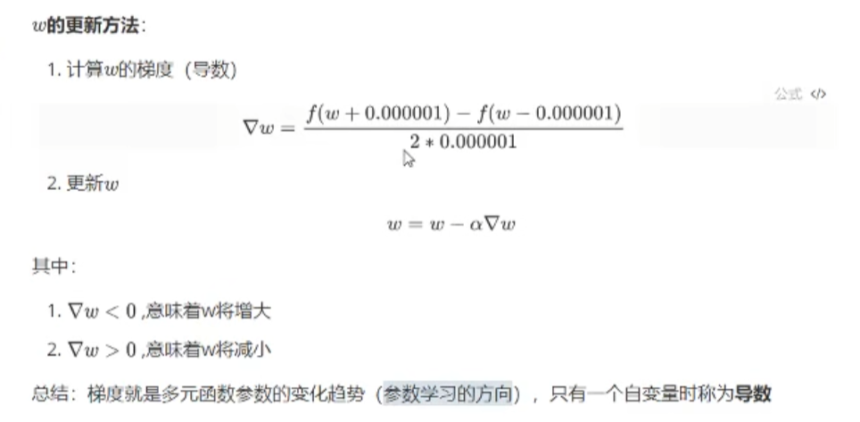

# 一、梯度
## 1.梯度是什么
+ 梯度：一个向量
+ 学习（参数更新的）方向
+ 简单理解就是一个导数/偏导
## 2.梯度下降
梯度下降,是机器学习的方法

#  二、反向传播
## 1.计算图
3(a+bc):

对每一个变量求偏导

从右往左算梯度。进行反向传播
## 2.神经网络的反向传播
### 神经网络的示意图

## 神经网络的计算图

x2到out有两条线段的时候改怎么办？

公式：

分为两部分

所以一层一层的计算

计算过程

***通用公式***

这说的不是很明了，这个视频讲的通俗易懂
【[5分钟深度学习] #02 反向传播算法:https://www.bilibili.com/video/BV1yG411x7Cc?p=2&vd_source=93bc797b057b94d827f957fe20303b2c
pytorch函数里面的
